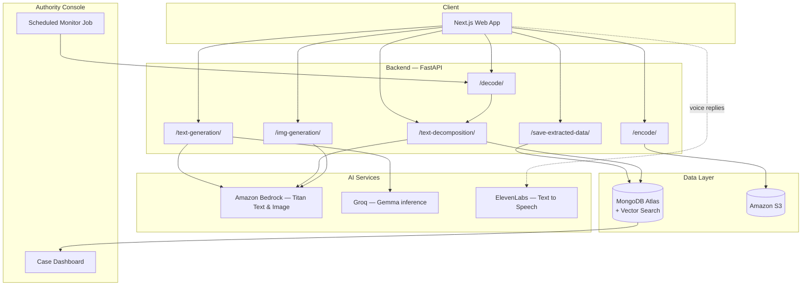
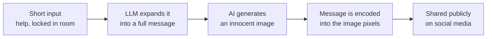
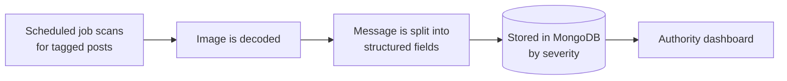
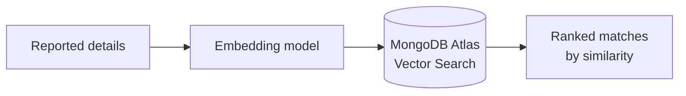
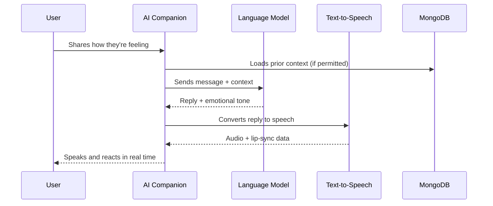
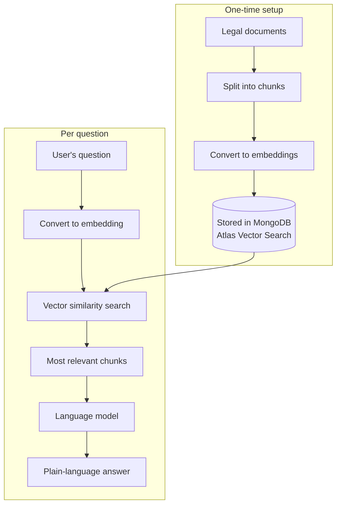

# Haven

**A silent shield. A strong voice.**

Haven is a safety platform for women in abusive situations. It gives people a way to ask for help, talk to someone about their mental health, and understand their legal rights — without their abuser ever knowing.

[Live App](https://haven-aws.framer.website/) · [Demo Video](https://youtu.be/CnBBirolT2U)

---

## Table of Contents

- [Why Haven Exists](#why-haven-exists)
- [What Haven Does](#what-haven-does)
- [System Architecture](#system-architecture)
- [Feature 1: Discreet SOS Messaging](#feature-1-discreet-sos-messaging)
- [Feature 2: AI Companion for Mental Health Support](#feature-2-ai-companion-for-mental-health-support)
- [Feature 3: Legal Rights Assistant](#feature-3-legal-rights-assistant)
- [Tech Stack](#tech-stack)
- [API Reference](#api-reference)
- [Where MongoDB Fits In](#where-mongodb-fits-in)
- [Getting Started](#getting-started)
- [Privacy and Safety](#privacy-and-safety)

---

## Why Haven Exists

Globally, 1 in 3 women experiences physical or sexual violence in her lifetime, most often from a partner. In India, national health surveys put that number at roughly 30%. Abusers commonly monitor phones, social media, and messages, which cuts off the usual ways of asking for help.

Haven is built around that constraint: every feature is designed to work in plain sight of someone who is watching.

---

## What Haven Does

| Feature | Problem It Solves |
|---|---|
| **Discreet SOS Messaging** | Lets a woman send a distress signal hidden inside an ordinary photo, so a post that looks harmless can actually be a call for help |
| **AI Companion** | Gives 24/7, private, judgment-free mental health support to survivors, most of whom never see a therapist |
| **Legal Rights Assistant** | Answers questions about abuse, custody, and property law instantly, in plain language, for the majority of women who have no access to a lawyer |

---

## System Architecture



Three services sit behind one backend: a messaging pipeline, a support chatbot, and a legal search engine. All three read and write through the same MongoDB Atlas cluster, which also powers vector search for matching and legal lookup.

---

## Feature 1: Discreet SOS Messaging

A woman under surveillance can't post "help me" and expect to stay safe. Haven turns a short, typed cue into a full distress message, then hides that message inside a normal-looking photo before it's shared.

### On the Sender's Side



### On the Authority's Side



The photo looks like any other post. Nothing about it suggests a hidden message, so it draws no attention from anyone watching the account.

### Culprit Matching

When a report includes details about the person responsible, Haven can search past reports for similar profiles.



```yaml
$vectorSearch:
  path: culprit_embedding
  index: culpritIndex
  similarity: euclidean
  type: knn
```

This lets an authority connect reports that describe the same person, even when they were filed separately.

---

## Feature 2: AI Companion for Mental Health Support

Only a small fraction of abuse survivors ever speak to a mental health professional, usually out of fear of being overheard or judged. Haven's companion is available at any hour, remembers context between sessions with consent, and responds with voice and expression rather than plain text.



The avatar's facial expressions are mapped to the tone of its reply, and speech is generated and lip-synced live, so the interaction feels like a conversation rather than a chat window.

---

## Feature 3: Legal Rights Assistant

Most survivors never speak to a lawyer, not because they don't need one but because legal help is expensive or hard to reach. Haven's assistant is trained on the Indian Constitution and related statutes, and answers questions about abuse, custody, and property rights in plain language.



Ask "what do I do if my spouse is abusing me?" and the assistant returns concrete next steps, such as filing a complaint or applying for a restraining order, based on the retrieved legal text rather than a generic script.

---

## Tech Stack

| Layer | Tools |
|---|---|
| Frontend | Next.js, TypeScript, Tailwind CSS, GLTF (3D avatar rendering) |
| Backend | Python 3.12, FastAPI, Pydantic |
| AI / ML | Amazon Bedrock (Titan Text, Titan Image), Groq (Gemma), ElevenLabs (voice), LangChain |
| Data | MongoDB Atlas + Vector Search, Amazon S3 |
| Auth | Clerk |
| Hosting | Vercel (frontend), Render (backend) |

---

## API Reference

| Route | Purpose |
|---|---|
| `POST /text-generation` | Expands short input into a full message |
| `POST /img-generation` | Generates a cover image |
| `POST /encode` | Hides a message inside an image |
| `POST /decode` | Extracts a hidden message from an image |
| `POST /text-decomposition` | Splits a message into structured fields |
| `POST /save-extracted-data` | Saves a structured case to MongoDB |

---

## Where MongoDB Fits In

- Stores every SOS report and the embeddings used to match cases to the same suspect
- Acts as the vector store behind the legal assistant's document search
- Holds a user's prior conversation context with the companion, only when the user has agreed to it
- Runs on a cluster hosted on AWS

---

## Getting Started

### Requirements

You'll need a MongoDB Atlas cluster and API keys for Gemini, Groq, Clerk, ElevenLabs, and AWS.

### Backend

```bash
python -m venv .venv
.\.venv\Scripts\Activate
pip install -r backend/requirements.txt
```

Create a `.env` file:

```env
MONGO_ENDPOINT=
GEMINI_API_KEY=
GROQ_API_TOKEN=
AWS_ACCESS_KEY_ID=
AWS_SECRET_ACCESS_KEY=
AWS_REGION=
S3_BUCKET_NAME=
```

Run the server:

```bash
uvicorn backend.main:app --reload
```

API docs are available at:

`http://127.0.0.1:8000/docs`

### Frontend

```bash
npm install
npm run dev
```

Create a `.env.local` file:

```env
NEXT_PUBLIC_CLERK_PUBLISHABLE_KEY=
CLERK_SECRET_KEY=
GOOGLE_API_KEY=
NEXT_PUBLIC_CLERK_SIGN_IN_URL=/sign-in
NEXT_PUBLIC_CLERK_SIGN_UP_URL=/sign-up
```

The app runs at:

`http://localhost:3000/`

---

## Privacy and Safety

- Conversation history with the companion is stored only with the user's consent
- Data behind the legal assistant is limited to public legal text, not personal information
- SOS images are visually identical to ordinary photos; nothing in the file signals that a message is hidden
- Case data is indexed by severity so authorities can prioritize urgent reports first

---

## Project Links

- [Live App](https://haven-aws.framer.website/)
- [Demo Video](https://youtu.be/CnBBirolT2U)
